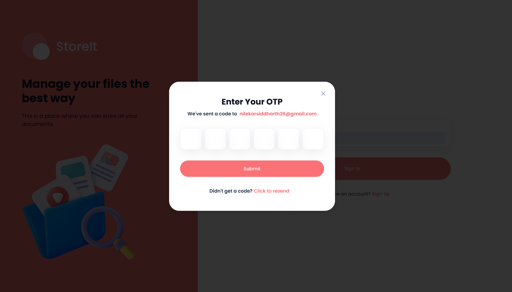

 <h1>Store It</h1>
   

  

    
    
    
    
    
    
  

<h3 align="center">Storage and File Sharing Platform</h3>

## 📋 <a name="table">Table of Contents</a>

1. 🤖 [Introduction](#introduction)
2. ⚙️ [Tech Stack](#tech-stack)
3. 🔋 [Features](#features)
4. 🔗 [Screenshots](#screenshots)
5. 🤸 [Local Setup](#setup)

## <a name="introduction">🤖 Introduction</a>

A storage management and file-sharing platform that lets users effortlessly upload, organize, and share files. Built with the latest Next.js 15 and the Appwrite Node SDK, utilizing advanced features for seamless file management.

## <a name="tech-stack">⚙️ Tech Stack</a>

- **React 19**
- **Next.js 15**
- **Appwrite**
- **TailwindCSS**
- **ShadCN**
- **TypeScript**

## <a name="features">🔋 Features</a>

👉 **User Authentication with Appwrite**: Implement signup, login, and logout functionality using Appwrite's authentication system.

👉 **File Uploads**: Effortlessly upload a variety of file types, including documents, images, videos, and audio, ensuring all your important data is stored securely.

👉 **View and Manage Files**: Browse through uploaded files, view them in a new tab, rename, or delete files stored in Appwrite storage.

👉 **Download Files**: Instantly access your essential documents by downloading them.

👉 **File Sharing**: Easily share uploaded files with others, enabling collaboration and easy access to important content.

👉 **Dashboard**: Get insights at a glance with a dynamic dashboard showcasing total and consumed storage, recent uploads, and a file summary grouped by type.

👉 **Global Search**: Quickly find files and shared content with a robust global search feature.

👉 **Sorting Options**: Sort files by date, name, or size to keep your files organized.

👉 **Responsive Design**: A fresh, minimalist UI that emphasizes usability, ensuring a clean aesthetic across all devices.

And many more features, utilizing the latest **React 19**, **Next.js 15**, and **Appwrite**.

## <a name="screenshots">🔗 Screenshots</a>

- **Homepage**: 
- **Dashboard**: 
- **Images Page and Share Functionality**: 
- **OTP Model**: 

### Mobile Screenshots:

- **Mobile Homepage**: 
- **Mobile Dashboard**: 
- **Mobile Navigation**: 

## Credits
- This project is done with the help of this video on youtube : [Video Link](https://youtu.be/lie0cr3wESQ?si=vR0XD1NtU-_iLZAi)
- You can check out his channel for more such videos [Javascript Mastery](https://www.youtube.com/@javascriptmastery)